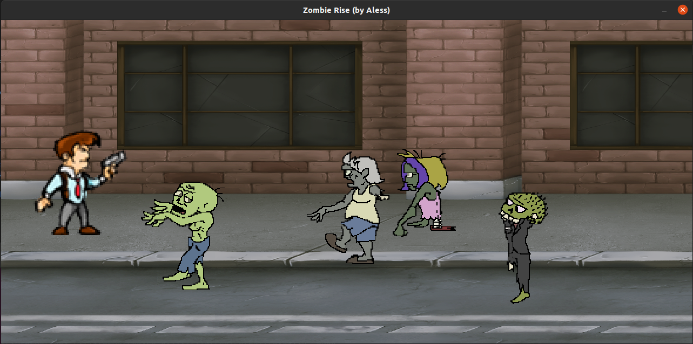

# ZombieRise
WIP - Action zombie killing side-scrolling game in Ruby (just for fun / study ;-)

# side-scrolling

A side-scrolling video game, sometimes shortened to side-scroller, is a game in which the action is viewed from a side-view camera angle, and the screen follows the player as they move left or right. The jump from single-screen or flip-screen graphics to scrolling graphics during the golden age of video arcade games was a pivotal leap in game design, comparable to the move to 3D graphics during the fifth generation.

Hardware support of smooth scrolling backgrounds is built into many arcade systems and some game consoles and home computers, including the Atari 8-bit family and Nintendo Entertainment System. 16-bit consoles such as the Super NES added multiple layers which can be scrolled independently for a parallax scrolling effect. 

<table width:100%>
  <tr>
    <td></td>
  </tr>
</table>

# Install the gem ruby2d

    $sudo apt-get update

    $sudo apt-get install libsdl2-dev libsdl2-image-dev libsdl2-mixer-dev libsdl2-ttf-dev

    $gem install ruby2d

# Run the game

    $ruby main